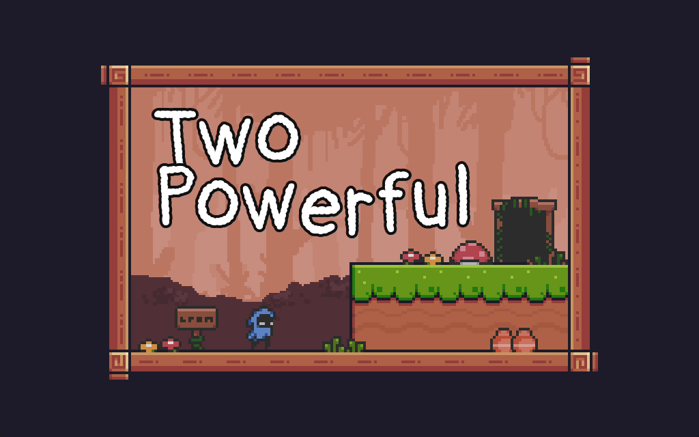

<a href="https://senhung.itch.io/two-orbs">

</a>

A game for [United Game Jam 2020](https://itch.io/jam/united-game-jam-2020). Theme "Two".

---

<a href="https://senhung.itch.io/two-orbs">

</a>

You can only hold 2 orbs at once. Different orb will give you different abilities (double jump, dash, etc). However you will only keep the last two orbs, so plan your route wisely!

## Control:

| Action  |    Key    |
| :-----: | :-------: |
|  Move   |    A/D    |
|  Jump   |     K     |
|  Dash   | L + W/A/D |
| Attack  |     J     |
| Pick Up |     I     |
|  Info   |    Tab    |

Play in [Browser](https://senhung.itch.io/two-orbs)

Hope you enjoy the game!

## Credits

Sprites:

[PIXEL ART PLATFORM/METROIDVANIA ASSET PACK](https://o-lobster.itch.io/platformmetroidvania-pixel-art-asset-pack)

[Pixel Adventure 1](https://pixel-frog.itch.io/pixel-adventure-1)

Font:

[m3x6](https://managore.itch.io/m3x6)

Background music created using:

[Music Grid](https://music-grid.surge.sh/)
